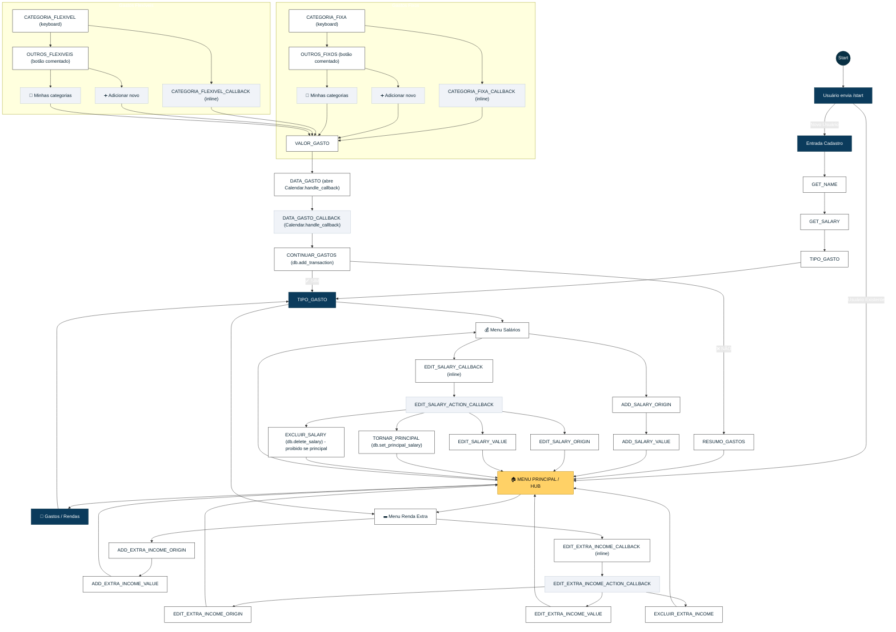

```mermaid
flowchart TB
 subgraph FIXAS["Gastos Fixos"]
    direction TB
        Gastos_CAT_FIXA["CATEGORIA_FIXA (keyboard)"]
        CATEGORIA_FIXA_CALLBACK["CATEGORIA_FIXA_CALLBACK (inline)"]
        Gastos_VALOR_GASTO["VALOR_GASTO"]
        Gastos_OUTROS_FIXOS["OUTROS_FIXOS (botão comentado)"]
        Gastos_NOVA_CAT_FIXA["➕ Adicionar novo"]
        Gastos_MINHAS_CAT_FIXAS["📂 Minhas categorias"]
  end
 subgraph FLEX["Gastos Flexíveis"]
    direction TB
        Gastos_CAT_FLEX["CATEGORIA_FLEXIVEL (keyboard)"]
        CATEGORIA_FLEX_CALLBACK["CATEGORIA_FLEXIVEL_CALLBACK (inline)"]
        Gastos_OUTROS_FLEX["OUTROS_FLEXIVEIS (botão comentado)"]
        Gastos_NOVA_CAT_FLEX["➕ Adicionar novo"]
        Gastos_MINHAS_CAT_FLEX["📂 Minhas categorias"]
  end
    Start(("Start")) --> StartCommand["Usuário envia /start"]
    StartCommand -- Novo Usuário --> CadastroEntry["Entrada Cadastro"]
    StartCommand -- Usuário Existente --> MainMenu["🏠 MENU PRINCIPAL / HUB"]
    CadastroEntry --> Cad_GET_NAME["GET_NAME"]
    Cad_GET_NAME --> Cad_GET_SALARY["GET_SALARY"]
    Cad_GET_SALARY --> Cad_TIPO_GASTO["TIPO_GASTO"]
    Cad_TIPO_GASTO --> Gastos_TIPO_GASTO["TIPO_GASTO"]
    MainMenu --> GastosEntry["🧾 Gastos / Rendas"] & Salarios_Menu["💰 Menu Salários"] & Renda_Menu["💵 Menu Renda Extra"]
    GastosEntry --> Gastos_TIPO_GASTO
    Gastos_TIPO_GASTO --> Salarios_Menu & Renda_Menu
    Gastos_CAT_FIXA --> CATEGORIA_FIXA_CALLBACK & Gastos_OUTROS_FIXOS
    CATEGORIA_FIXA_CALLBACK --> Gastos_VALOR_GASTO
    Gastos_OUTROS_FIXOS --> Gastos_NOVA_CAT_FIXA & Gastos_MINHAS_CAT_FIXAS
    Gastos_NOVA_CAT_FIXA --> Gastos_VALOR_GASTO
    Gastos_MINHAS_CAT_FIXAS --> Gastos_VALOR_GASTO
    Gastos_CAT_FLEX --> CATEGORIA_FLEX_CALLBACK & Gastos_OUTROS_FLEX
    CATEGORIA_FLEX_CALLBACK --> Gastos_VALOR_GASTO
    Gastos_OUTROS_FLEX --> Gastos_NOVA_CAT_FLEX & Gastos_MINHAS_CAT_FLEX
    Gastos_NOVA_CAT_FLEX --> Gastos_VALOR_GASTO
    Gastos_MINHAS_CAT_FLEX --> Gastos_VALOR_GASTO
    Gastos_VALOR_GASTO --> Gastos_DATA_GASTO["DATA_GASTO (abre Calendar.handle_callback)"]
    Gastos_DATA_GASTO --> DATA_GASTO_CALLBACK["DATA_GASTO_CALLBACK (Calendar.handle_callback)"]
    DATA_GASTO_CALLBACK --> Gastos_CONTINUAR["CONTINUAR_GASTOS (db.add_transaction)"]
    Gastos_CONTINUAR -- ✅ SIM --> Gastos_TIPO_GASTO
    Gastos_CONTINUAR -- ❌ NÃO --> Gastos_RESUMO["RESUMO_GASTOS"]
    Gastos_RESUMO --> MainMenu
    Salarios_Menu --> AddSalary_ORIGIN["ADD_SALARY_ORIGIN"] & EditSalary_SELECT["EDIT_SALARY_CALLBACK (inline)"]
    AddSalary_ORIGIN --> AddSalary_VALUE["ADD_SALARY_VALUE"]
    AddSalary_VALUE --> MainMenu
    EditSalary_SELECT --> EditSalary_ACTION["EDIT_SALARY_ACTION_CALLBACK"]
    EditSalary_ACTION --> EditSalary_ORIGIN["EDIT_SALARY_ORIGIN"] & EditSalary_VALUE["EDIT_SALARY_VALUE"] & Make_Principal["TORNAR_PRINCIPAL (db.set_principal_salary)"] & Delete_Salary["EXCLUIR_SALARY (db.delete_salary) - proibido se principal"]
    EditSalary_ORIGIN --> MainMenu
    EditSalary_VALUE --> MainMenu
    Make_Principal --> MainMenu
    Delete_Salary --> MainMenu
    Renda_Menu --> AddExtra_ORIGIN["ADD_EXTRA_INCOME_ORIGIN"] & EditExtra_SELECT["EDIT_EXTRA_INCOME_CALLBACK (inline)"]
    AddExtra_ORIGIN --> AddExtra_VALUE["ADD_EXTRA_INCOME_VALUE"]
    AddExtra_VALUE --> MainMenu
    EditExtra_SELECT --> EditExtra_ACTION["EDIT_EXTRA_INCOME_ACTION_CALLBACK"]
    EditExtra_ACTION --> EditExtra_ORIGIN["EDIT_EXTRA_INCOME_ORIGIN"] & EditExtra_VALUE["EDIT_EXTRA_INCOME_VALUE"] & Delete_Extra["EXCLUIR_EXTRA_INCOME"]
    EditExtra_ORIGIN --> MainMenu
    EditExtra_VALUE --> MainMenu
    Delete_Extra --> MainMenu
     Start:::root
     Start:::root
     StartCommand:::section
     CadastroEntry:::section
     MainMenu:::accent
     Cad_GET_NAME:::box
     Cad_GET_SALARY:::box
     Cad_TIPO_GASTO:::box
     Gastos_TIPO_GASTO:::box
     Gastos_TIPO_GASTO:::section
     GastosEntry:::section
     Salarios_Menu:::box
     Renda_Menu:::box
     Gastos_CAT_FIXA:::box
     CATEGORIA_FIXA_CALLBACK:::mini
     Gastos_VALOR_GASTO:::box
     Gastos_OUTROS_FIXOS:::box
     Gastos_NOVA_CAT_FIXA:::mini
     Gastos_MINHAS_CAT_FIXAS:::mini
     Gastos_CAT_FLEX:::box
     CATEGORIA_FLEX_CALLBACK:::mini
     Gastos_OUTROS_FLEX:::box
     Gastos_NOVA_CAT_FLEX:::mini
     Gastos_MINHAS_CAT_FLEX:::mini
     Gastos_DATA_GASTO:::box
     DATA_GASTO_CALLBACK:::mini
     Gastos_CONTINUAR:::box
     Gastos_RESUMO:::box
     AddSalary_ORIGIN:::box
     AddSalary_VALUE:::box
     EditSalary_SELECT:::box
     EditSalary_ACTION:::mini
     EditSalary_ORIGIN:::box
     EditSalary_VALUE:::box
     Make_Principal:::box
     Delete_Salary:::box
     AddExtra_ORIGIN:::box
     AddExtra_VALUE:::box
     EditExtra_SELECT:::box
     EditExtra_ACTION:::mini
     EditExtra_ORIGIN:::box
     EditExtra_VALUE:::box
     Delete_Extra:::box
    classDef section fill:#0b3b5c,stroke:#083044,color:#ffffff,stroke-width:1px
    classDef box fill:#ffffff,stroke:#2d2d2d,color:#0b2433,stroke-width:1px
    classDef mini fill:#f0f3f8,stroke:#bfcad6,color:#0b2433,stroke-width:1px
    classDef accent fill:#ffd166,stroke:#b88600,color:#111111,stroke-width:1px
    classDef root fill:#083044,stroke:#05232e,color:#ffffff,stroke-width:1px
```

```mermaid
flowchart TB
    MainMenu["🏠 MENU PRINCIPAL / HUB"] --> ObjetivosEntry["🎯 Objetivos"] & Action_Ajuda["/ajuda"] & Action_Resumo["/resumo"]
    ObjetivosEntry --> Objetivos_Menu["🎯 Menu Objetivos"]
    Objetivos_Menu --> Goals_TYPE["GOAL_TYPE"] & UpdateGoal_SELECT["Atualizar Progresso (SELECT_GOAL callback)"] & DeleteGoal_SELECT["Excluir Objetivo (SELECT_GOAL_DELETE callback)"] & Action_MeusObjetivos["📋 Meus Objetivos"]
    Goals_TYPE --> Goals_DESC["GOAL_DESCRIPTION"]
    Goals_DESC --> Goals_TARGET["GOAL_TARGET"]
    Goals_TARGET --> Goals_DEADLINE["GOAL_DEADLINE (abre Calendar.handle_callback)"]
    Goals_DEADLINE --> GOAL_DEADLINE_CALLBACK["GOAL_DEADLINE_CALENDAR_CALLBACK (callback)"]
    GOAL_DEADLINE_CALLBACK --> MainMenu
    UpdateGoal_SELECT --> UpdateGoal_VALUE["UPDATE_GOAL_PROGRESS"]
    UpdateGoal_VALUE --> MainMenu
    DeleteGoal_SELECT --> DeleteGoal_CONFIRM["CONFIRM_DELETE_GOAL (confirm callback)"]
    DeleteGoal_CONFIRM --> MainMenu
    Action_MeusObjetivos --> MainMenu
    MainMenu --- ExtratoSection["🧾 Meu Extrato"] & CategoriasSection["📂 Suas Categorias"] & ConfigSection["⚙️ Configurações"] & SaudeSection["📈 Saúde Financeira"] & EduSection["🎓 Educação Financeira"]
    ExtratoSection --> Extrato_EntryPoint["EXTRATO_MES (abre MonthYearCalendar.handle_callback)"]
    Extrato_EntryPoint --> EXTRATO_CAL_CALLBACK["EXTRATO_MES_CALENDAR_CALLBACK (callback)"]
    EXTRATO_CAL_CALLBACK --> Action_ShowExtrato["show_month_extrato (valida MM/AAAA ou MMAAAA)"]
    Action_ShowExtrato --> MainMenu
    CategoriasSection --> Cat_FIXAS["🏠 Fixas"] & Cat_FLEXIVEIS["🛒 Flexíveis"]
    Cat_FIXAS --> Cat_SELECT_EXCLUIR["SELECIONAR_CATEGORIA_EXCLUIR (callback)"]
    Cat_FLEXIVEIS --> Cat_SELECT_EXCLUIR
    Cat_SELECT_EXCLUIR --> Cat_CONFIRM_EXCLUIR["CONFIRMAR_EXCLUSAO_CATEGORIA\n(❗ Categoria excluída; transações permanecem)"]
    Cat_CONFIRM_EXCLUIR --> MainMenu
    ConfigSection --> Config_EDIT_NAME["EDIT_NAME"] & Config_EDIT_SALARY["EDIT_SALARY"] & Config_CONFIRM_RESET["CONFIRM_RESET (sim/nao)"]
    Config_EDIT_NAME --> MainMenu
    Config_EDIT_SALARY --> MainMenu
    Config_CONFIRM_RESET --> MainMenu
    SaudeSection --> Action_VerMetricas["Ver Métricas (ver_metricas_handler)"] & Action_Recomendacoes["Recomendações IA (recomendacoes_ia_handler)"] & Action_AnaliseIA["Análise Detalhada IA (analise_detalhada_handler / callback)"]
    Action_VerMetricas --> MainMenu
    Action_Recomendacoes --> MainMenu
    Action_AnaliseIA --> MainMenu
    EduSection --> Action_DicaDia["Dica do Dia"] & Action_Glossario["Glossário"] & Action_Modulos["Módulos Educativos (callback)"]
    Action_DicaDia --> MainMenu
    Action_Glossario --> MainMenu
    Action_Modulos --> MainMenu
    Action_Ajuda --> MainMenu
    Action_Resumo --> MainMenu
     MainMenu:::accent
     ObjetivosEntry:::section
     Action_Ajuda:::box
     Action_Resumo:::box
     Objetivos_Menu:::section
     Goals_TYPE:::box
     UpdateGoal_SELECT:::box
     DeleteGoal_SELECT:::box
     Action_MeusObjetivos:::box
     Goals_DESC:::box
     Goals_TARGET:::box
     Goals_DEADLINE:::box
     GOAL_DEADLINE_CALLBACK:::mini
     UpdateGoal_VALUE:::box
     DeleteGoal_CONFIRM:::box
     ExtratoSection:::section
     CategoriasSection:::section
     ConfigSection:::section
     SaudeSection:::section
     EduSection:::section
     Extrato_EntryPoint:::box
     EXTRATO_CAL_CALLBACK:::mini
     Action_ShowExtrato:::box
     Cat_FIXAS:::box
     Cat_FLEXIVEIS:::box
     Cat_SELECT_EXCLUIR:::box
     Cat_CONFIRM_EXCLUIR:::box
     Config_EDIT_NAME:::box
     Config_EDIT_SALARY:::box
     Config_CONFIRM_RESET:::box
     Action_VerMetricas:::box
     Action_Recomendacoes:::box
     Action_AnaliseIA:::box
     Action_DicaDia:::box
     Action_Glossario:::box
     Action_Modulos:::box
    classDef section fill:#0b3b5c,stroke:#083044,color:#ffffff,stroke-width:1px
    classDef box fill:#ffffff,stroke:#2d2d2d,color:#0b2433,stroke-width:1px
    classDef mini fill:#f0f3f8,stroke:#bfcad6,color:#0b2433,stroke-width:1px
    classDef accent fill:#ffd166,stroke:#b88600,color:#111111,stroke-width:1px
```
